##### 안녕하세요 플레이데이터입니다. 
##### 플레이데이터 취업교육과정 수강생 여러분의 사전교육을 위한 repository(=repo)입니다.

##### 진행 순서는 다음과 같습니다.
1. python 설치
2. pycharm(IDE) 설치
3. git 설치
4. github 회원 가입
5. 퀴즈 가져오기 (encore-playdata의 repo를 내 계정으로 Clone하기)
6. 퀴즈 변동사항 저장하기 (내 계정의 repo로 변동사항 push하기)
7. 퀴즈 제출하기 (퀴즈를 모두 풀고 encore-playdata의 repo에 pull request하기)

##### 플레이데이터 깃허브에 pull request 해주시면 확인 후 업데이트 해드립니다.
##### 처음엔 git을 사용하는 방법이 생소하겠지만, 실무에서 꼭 필요한 도구이니 많이 사용해보시기 바랍니다.
 

##### 🎈Python설치 ~ Git설치(1~4번)은 아래 url을 참고해주세요 
https://www.notion.so/playdatacademy/for-f74c2555d11d4da6b895ff949f5d5762
  

# [5. 퀴즈 가져오기] (encore-playdata의 repo를 내 계정으로 Clone하기)

#### 1. Github 회원가입을 아직 하지 않은 분들은 우측 상단에서 회원가입을 먼저 해주세요. 
  

#### 2. 우측상단의 'Fork' 버튼을 클릭해주세요.
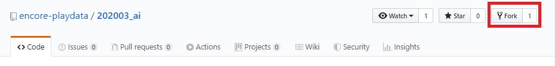
  

#### 3. 'Fork' 버튼을 클릭하면 플레이데이터의 repository를 내 repository로 가져올 수 있습니다.
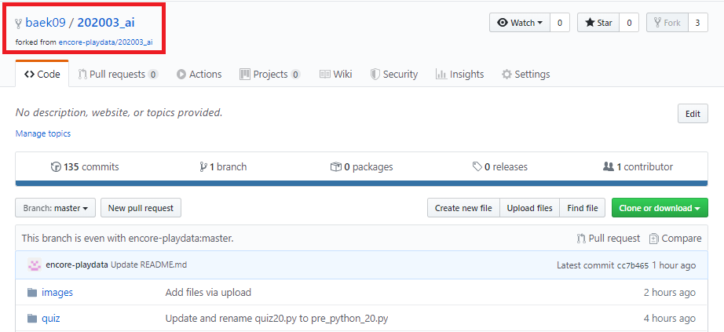
  

#### 4. 이제 플레이데이터의 프로젝트를 내 로컬환경으로 clone하겠습니다.
우측에 'clone or download' 초록색 버튼을 클릭하고 주소를 복사합니다. 

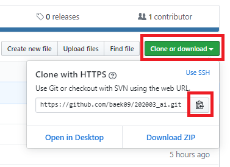
  

#### 5. 로컬 환경으로 돌아가 git Bash(terminal)를 실행합니다. 

  

#### 6. git Bash(terminal)에서 명어를 이용해 바탕화면에 폴더를 생성하고 폴더에 파일을 clone합니다. (**아래 순서대로 진행한 후 퀴즈 답안을 제출할 때까지 Git Bash를 끄지말고 진행해주세요! 중간에 끄시면 6번의 순서를 다시 진행하셔야 합니다.)

- 첫번째, 바탕화면으로 이동하기 (cd 이동하고싶은폴더명)
     <blockquote> cd desktop </blockquote>

- 두번째, 바탕화면에 폴더 만들기 (mkdir 만들고싶은폴더명)
     <blockquote> mkdir playdata </blockquote>

- 세번째, 생성한 폴더로 이동하기
     <blockquote> cd playdata </blockquote>

- 네번째, 내 컴퓨터에 github에 있는 파일을 복사하기 (주소는 과제 가져오기 4번에서 복사한 주소를 사용합니다)
     <blockquote> git clone 복사한 주소 </blockquote>

- 다섯번째, 복사된 폴더로 들어가기
     <blockquote> cd 202003_ai </blockquote>

- 여섯번째, 이메일과 이름 
     <blockquote> git config --global user.email "내 이메일작성" </blockquote>
     <blockquote> git config --global user.name "내 이름작성" </blockquote>
    
   

# [6. 퀴즈 변동사항 저장하기] (내 계정의 repo로 변동사항 push하기)

#### 먼저 Git에 대해 간단히 알아보겠습니다.
#### 깃은 아래와 같은 흐름으로 이루어져 있습니다.

- 간단하게 보면, 우리가 workspace에서 작업하여 파일이 변경되면 add 라는 명령어로 index에 반영시킵니다.
- index된 상태에서 commit하면, local repository에 반영되고, remote repository에 저장가능한 상태가 됩니다.
- 이 때, push 라는 명령어로 remote repository인 온라인 github에 업로드하게 됩니다
- 온라인 github에 있는 데이터를 내 컴퓨터로 가져올 때는 pull 이라는 명령어를 사용합니다.

 

- 정리하면 github에 업로드하기 위해서는 add -> commit -> push 순서로 진행하고,
- 반대로 github 내용을 가져오기 위해서는 clone이나 pull 등을 이용합니다.

 

- 아직은 무슨말인지 잘 이해가 안가실텐데요, 아래 적혀있는대로 따라해보면서 간단하게 사용법만 익히셔도 좋습니다.
- git이 무엇인지, 기본용어는 무엇이 있는지, https://nolboo.kim/blog/2013/10/06/github-for-beginner/ 이 링크에서 확인해주세요.
- git을 좀 더 깊이 사용하고 싶다면 https://www.opentutorials.org/course/2708 이곳에서 공부하셔도 좋습니다.
- 나중에 git 사용법은 특강이 있을 예정이니 너무 걱정마세요!

 

#### 1. 우선 pycharm을 키고 open을 클릭한 후, C:\Users\자신의컴퓨터명\Desktop\playdata ok 버튼을 클릭합니다.
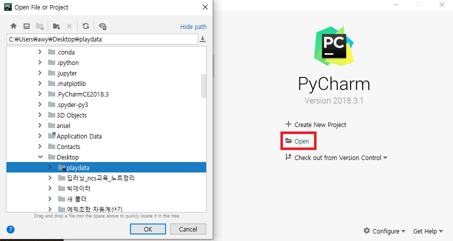

#### 2. 왼쪽 폴더 리스트에서 자신의 이름 폴더를 찾습니다. 이름 폴더에서 마우스 우클릭을 하여 New -> Python File을 클릭합니다.
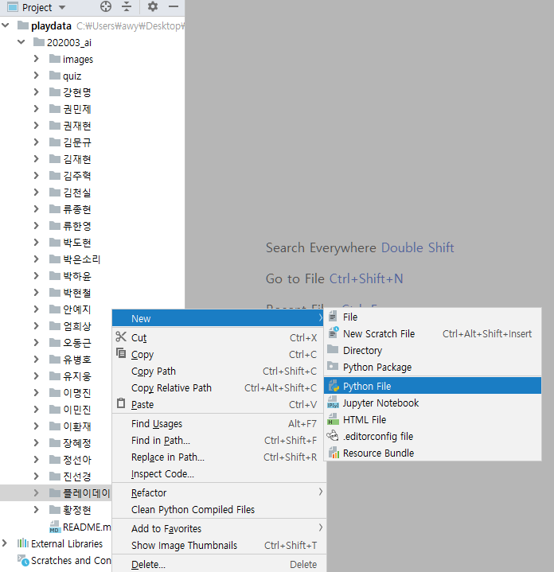

#### 3. 먼저, pycharm으로 gitTest.py를 만들어 저장합니다. 이때 파일명(gitTest)은 퀴즈명과 번호를 지정하여 저장해줍니다.

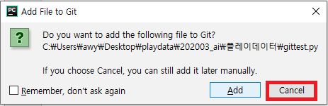
 

#### 4. gitTest.py에는 다음과 같이 입력 후 저장(ctrl+s)합니다.
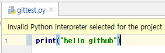
<blockquote> print("hello github!") </blockquote>
 

#### 5. 다시 Git Bash로 가보겠습니다. gitTest.py가 있는 폴더에서 "git status"를 입력합니다.
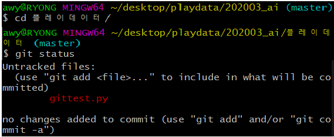
- cd 자신의이름 폴더명
- git status 명령어는 로컬저장소의 상태를 확인할 수 있습니다.
 

#### 6. 자, 그럼 위에서 이야기한대로 add -> commit -> push 순으로 내 github에 작성한 퀴즈 답안을 업로드 해보겠습니다.

- 첫번째, 먼저 내가 만든 파일을 index 하겠습니다.
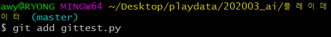
 

- 두번째, 다시 한 번 git status로 로컬저장소의 상태를 확인해봅니다.
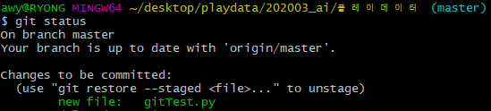
 

- 세번째, 다음은 index된 파일을 commit하여 local repository에 기록하겠습니다.
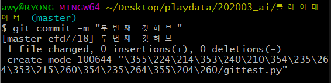
 

- 네번째, 여기까지 잘 오셨다면, 이제 내 온라인 github에 한번 업로드해보겠습니다.
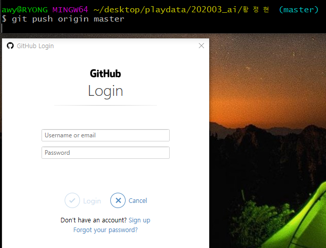
 

- 다섯번째, 내 GitHub로 가서 repository에 업데이트 된 내역을 확인해보세요.

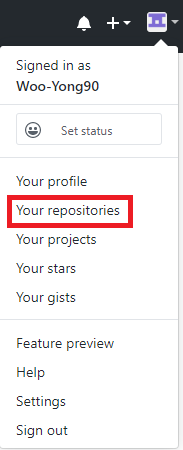

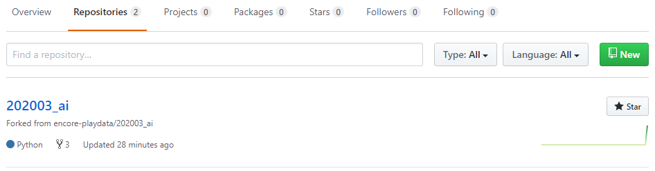

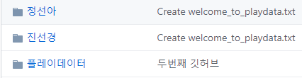

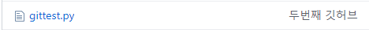
 
 
 

# [퀴즈 제출하기] (퀴즈를 풀고 encore-playdata의 repo에 pull request하기)

#### 1. 상단 메뉴의 'Pull Request' 탭을 클릭하고, 'New Pull Request'->'Create Pull Request' 버튼을 클릭합니다.

  

  

#### 2. 제목에 이름_00번 퀴즈 정답이라고 쓰고 'Create Pull Request'를 클릭합니다.

 

## 여기까지 문제없이 잘 하셨다면, 퀴즈 제출 완료!
## 이제 동일한 방법으로 다음 퀴즈를 풀고 제출해주시면 됩니다.
### 참 쉽죠?
