# 안녕하세요! 플레이데이터입니다😁

#### 플레이데이터 취업교육과정 수강생 여러분의 사전교육을 위한 repository(=repo)입니다.
#### 진행 순서는 다음과 같습니다.
1. Python 설치
2. PyCharm 설치(IDE)
3. Git 설치
4. GitHub 회원 가입
5. 퀴즈 가져오기
6. 퀴즈 푸는 도중에 변동사항 업데이트하기
7. 퀴즈 제출하기

#### 우선 아래 url을 참고해 1 ~ 4번 단계를 진행해주세요.
https://www.notion.so/playdatacademy/for-f74c2555d11d4da6b895ff949f5d5762
  
#### 5 ~ 7번 단계는 아래 설명을 따라 진행하면 됩니다. 
  

# [5. 퀴즈 가져오기]  
###### encore-playdata의 repository(=repo)를 내 계정으로 fork하고 이후 로컬환경으로 clone하기

#### 1. encore-playdata 계정의 pre-education repo로 이동한 후 우측상단의 'Fork' 버튼을 클릭해주세요.
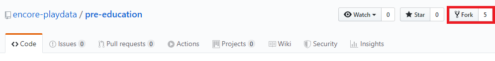
  

#### 2. 'Fork' 버튼을 클릭하면 encore-playdata의 repository를 내 repository로 가져올 수 있습니다.
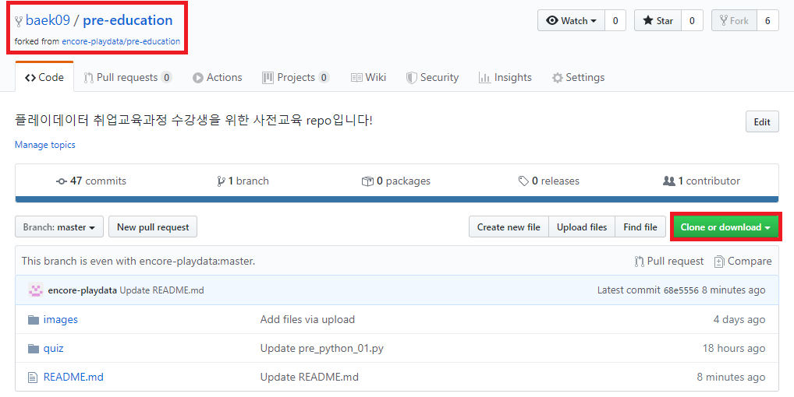
  

#### 3. 이제 fork한 repo를 내 로컬환경으로 clone하겠습니다.
우측에 'clone or download' 초록색 버튼을 클릭하고 주소를 복사합니다. 

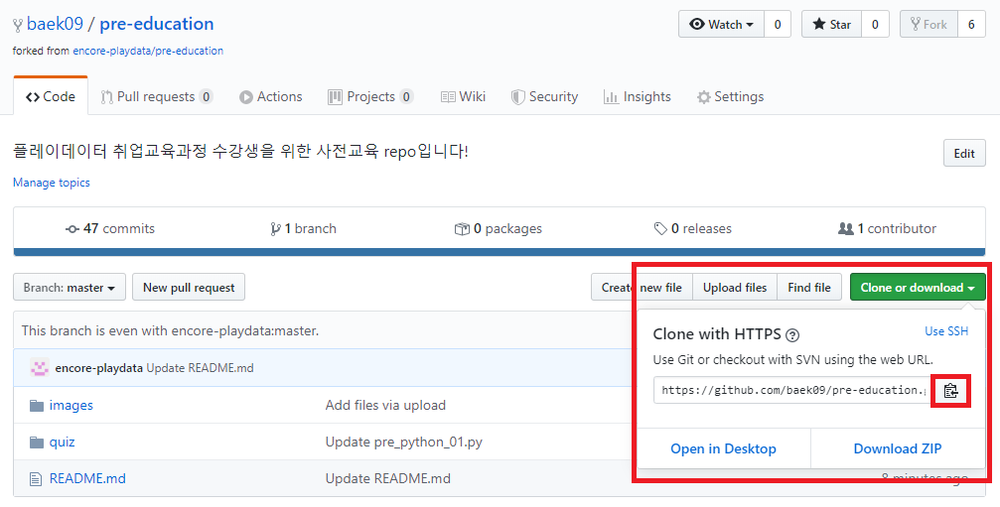
  

#### 4. 로컬 환경으로 돌아가 Git Bash(terminal)를 실행합니다. 
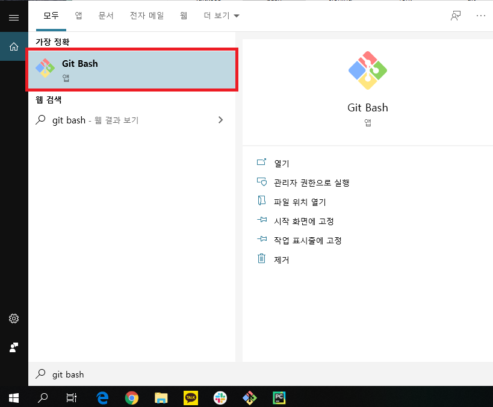
  

#### 5. Git Bash(terminal)에서 명령어를 이용해 바탕화면에 폴더를 생성하고 폴더에 파일을 clone합니다. (**아래 순서대로 진행한 후 퀴즈 답안을 제출할 때까지 Git Bash를 끄지말고 진행해주세요!)

- 첫번째, 바탕화면으로 이동하기 (cd 이동하고싶은폴더명)
     <blockquote> cd desktop </blockquote>

- 두번째, 바탕화면에 폴더 만들기 (mkdir 만들고싶은폴더명)
     <blockquote> mkdir playdata </blockquote>

- 세번째, 생성한 폴더로 이동하기
     <blockquote> cd playdata </blockquote>

- 네번째, 내 컴퓨터에 github에 있는 파일을 복사하기 (주소는 상단에 있는 3번 설명에서 복사한 주소를 사용합니다)
     <blockquote> git clone 복사한 주소 </blockquote>

- 다섯번째, 복사된 폴더로 들어가기
     <blockquote> cd pre-education </blockquote>

- 여섯번째, 이메일과 이름 설정하기 
     헷갈리지 않게 GitHub 계정에 사용한 계정명과 이메일을 사용해주세요.
     <blockquote> git config --global user.name "내 이름작성" </blockquote>
     <blockquote> git config --global user.email "내 이메일작성" </blockquote>
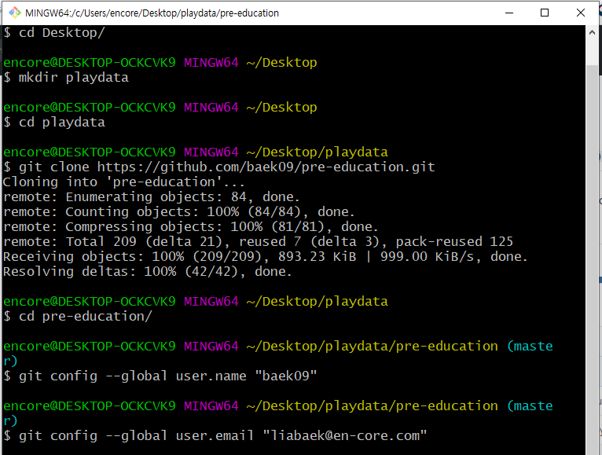    
    

# [6. repo에 변동사항 업데이트하기]   
###### 로컬환경의 변동사항을 내 계정의 repo로 push하기

#### 먼저 Git에 대해 간단히 알아보겠습니다.
#### 깃은 아래와 같은 흐름으로 이루어져 있습니다.

- 간단하게 보면, 우리가 workspace에서 작업하여 파일이 변경되면 add 라는 명령어로 index에 반영시킵니다.
- index된 상태에서 commit하면, local repository에 반영되고, remote repository에 저장가능한 상태가 됩니다.
- 이 때, push 라는 명령어로 remote repository인 온라인 github에 업로드하게 됩니다
- 온라인 github에 있는 데이터를 내 컴퓨터로 가져올 때는 pull 이라는 명령어를 사용합니다.

 

- 정리하면 GitHub에 업로드하기 위해서는 add -> commit -> push 순서로 진행하고,
- 반대로 GitHub 내용을 가져오기 위해서는 clone이나 pull 등을 이용합니다.

 

- 아직은 무슨말인지 잘 이해가 안가실텐데요, 아래 적혀있는대로 따라해보면서 간단하게 사용법만 익히셔도 좋습니다.
- Git이 무엇인지, 기본용어는 무엇이 있는지, https://nolboo.kim/blog/2013/10/06/github-for-beginner/ 이 링크에서 확인해주세요.
- Git을 좀 더 깊이 사용하고 싶다면 https://www.opentutorials.org/course/2708 이곳에서 공부하셔도 좋습니다.
- 나중에 Git 사용법은 특강이 있을 예정이니 너무 걱정마세요!

 

#### 1. 우선 pycharm을 키고 open을 클릭한 후, C:\Users\자신의컴퓨터명\Desktop\playdata ok 버튼을 클릭합니다.
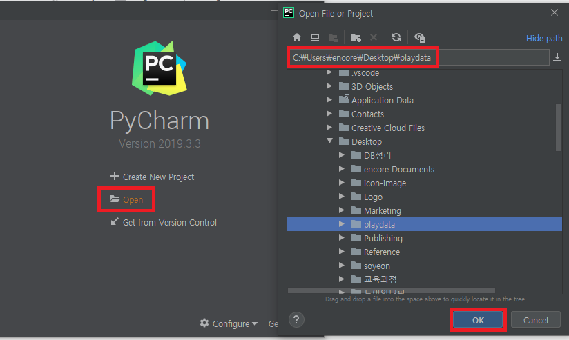

#### 2. 왼쪽 폴더 리스트에서 quiz 폴더를 찾습니다. 풀고 싶은 퀴즈를 더블클릭 합니다. 다 푼 뒤에는 ctrl+S를 눌러 저장합니다.
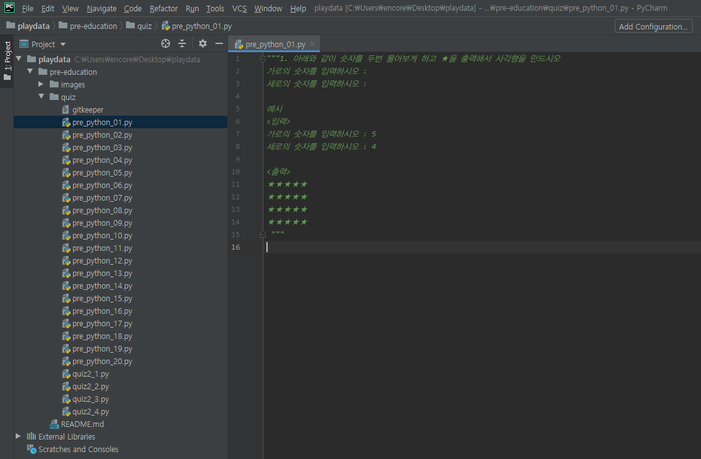

#### 3. 다시 Git Bash로 가보겠습니다. pre-education 폴더 위치에서 "git status"를 입력합니다. 수정된 내용이 있으면 빨간 네모박스처럼 표기됩니다.
- git status 명령어는 로컬저장소의 상태를 확인할 수 있습니다.
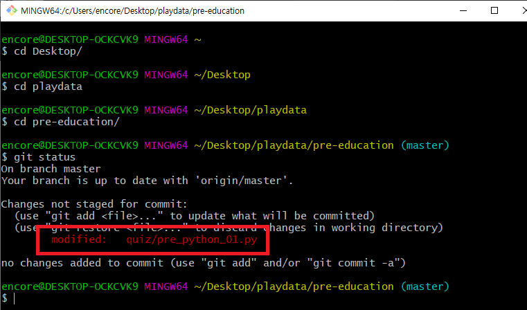
 

#### 4. 자, 그럼 위에서 이야기한대로 add -> commit -> push 순으로 내 github에 작성한 퀴즈 답안을 업로드 해보겠습니다.

- 첫번째, 내가 수정한 파일을 add 하겠습니다. git add 파일명 또는 git add * 를 입력합니다. 
     <blockquote> * 는 수정한 파일 전체를 한 번에 add 할 수 있습니다. </blockquote>
 

- 두번째, 다시 한 번 git status로 로컬저장소의 상태를 확인해봅니다.
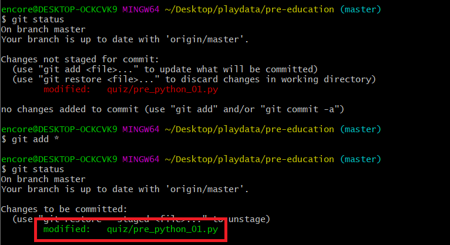
 

- 세번째, 다음은 modified된 파일을 commit하여 local repository에 기록하겠습니다. 그 다음은 내 온라인 github에 push 합니다.
     <blockquote> git commit -m "answer_quiz_01" </blockquote>
     <blockquote> commit 메세지는 위처럼 "answer_quiz_퀴즈번호"로 기재해줍니다. </blockquote>
     <blockquote> git push origin master </blockquote>

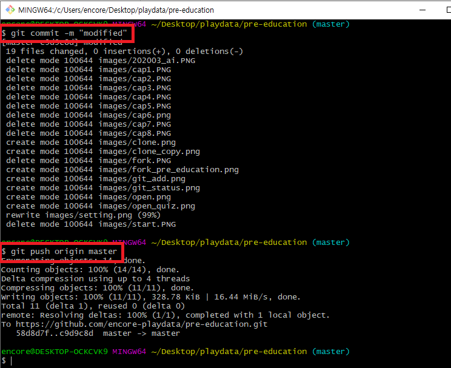
 

- 네번째, 내 GitHub로 가서 repository에 업데이트 된 내역을 확인해보세요!

 
 
  

# [7. 퀴즈 제출하기]   
###### 내 계정의 repo를 encore-playdata의 repo로 pull request하기 -> 퀴즈를 모두 풀고 진행하세요

#### 1. 상단 메뉴의 'Pull Request' 탭을 클릭하고, 'New Pull Request'->'Create Pull Request' 버튼을 클릭합니다.
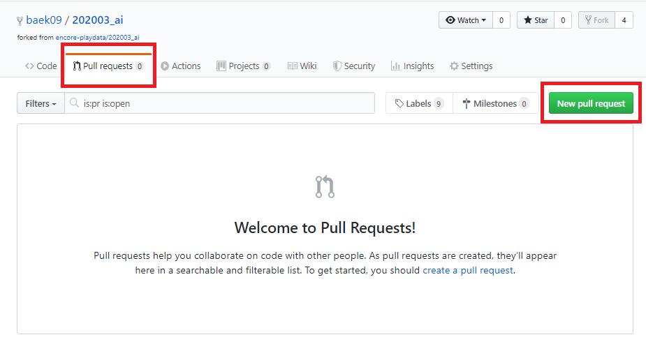
  
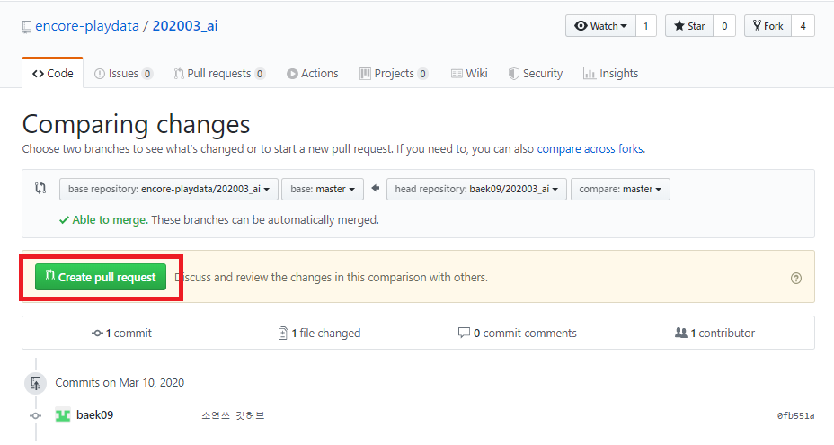
  

#### 2. 제목에 이름_00번 퀴즈 정답이라고 쓰고 'Create Pull Request'를 클릭합니다.
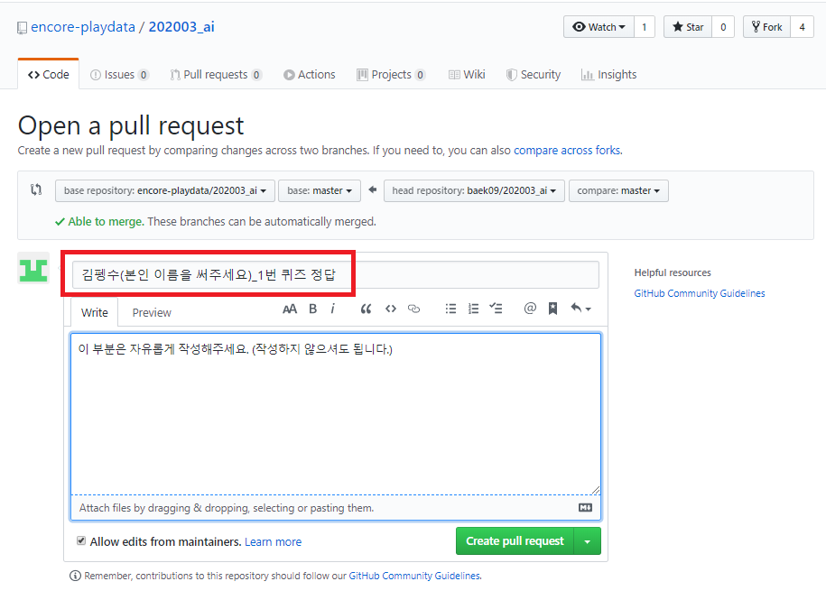
 

## 여기까지 문제없이 잘 하셨다면, 퀴즈 제출 완료!
## 이제 동일한 방법으로 다음 퀴즈를 풀고 제출해주시면 됩니다.
## 참 쉽죠?
